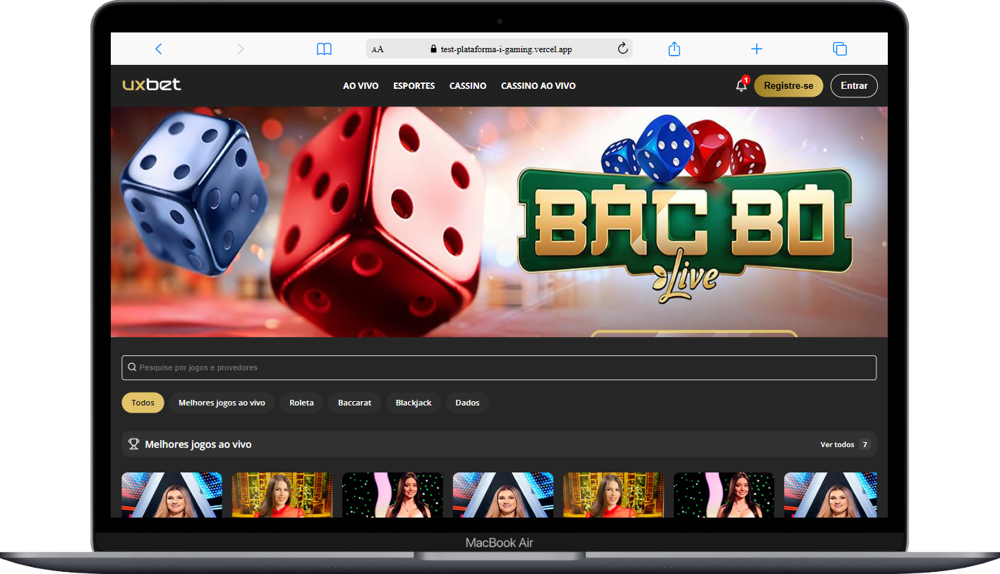

## 🌰 Plataforma de iGaming — Interface de Dashboard

Este projeto é parte do teste técnico da REALS para demonstrar habilidades no desenvolvimento de interfaces modernas utilizando React. A proposta é replicar uma dashboard de uma plataforma de apostas online (iGaming), com base em um design do Figma, utilizando dados estáticos (mockados).

### 🚀 Tecnologias Utilizadas

- **React** (Vite)
- **TypeScript**
- **CSS Modules**
- **Mock de dados (JSON local)** Escolhi ter apenas dois json para ficar mais simples.

### 📁 Estrutura do Projeto

```
src/
│
├── assets/            # Imagens e ícones usados na interface
├── components/        # Componentes reutilizáveis da interface
│   ├── Header/        # Cabeçalho com navegação e usuário
│   ├── Games/         # Jogos mockados
│   ├── Categories/    # Lista de categorias para filtro
│   └── ...
├── data/              # Arquivo estático com os dados mockados (games.json)
├── context/           # Context para passar a categoria
├── pages/             # Página principal da dashboard e login e registro
├── types/             # Schema do Zod para os forms
├── App.tsx
├── index.css          # CSS global
└── main.tsx
```

### 📸 Funcionalidades

- Visualização de uma grade de jogos (mockados)
- Filtro por categorias (ex: Ao vivo, Roleta, Blackjack, etc)
- Destaque visual para categoria ativa
- Responsividade
- Interações visuais com hover e seleção
- Animações suaves entre os elementos

### 🧪 Dados Mockados

Todos os jogos são carregados a partir de um JSON local com estrutura similar:

```json
{
  "id": 1,
  "title": "Jogo 1",
  "category": "Cassino",
  "image": "/assets/jogo1.jpg"
}
```

O filtro de categorias é gerado automaticamente a partir da propriedade `category` dos jogos.

### 💡 Observações

- Evitei o uso de bibliotecas externas para a construção do design da interface, como Swiper, bibliotecas de ícones ou qualquer outro tipo de framework de UI. Toda a estrutura e os estilos foram desenvolvidos manualmente com CSS Modules para manter o foco no desenvolvimento da interface a partir do zero.
- As únicas dependências utilizadas foram:

  ```json
  {
    "@hookform/resolvers": "^5.2.0",
    "react": "^19.1.0",
    "react-dom": "^19.1.0",
    "react-hook-form": "^7.61.1",
    "react-router": "^7.7.1",
    "zod": "^4.0.10"
  }
  ```

- **Não há conexão com backend ou autenticação real.**
  O login apenas simula o comportamento com dados armazenados no `localStorage` para fins de demonstração.

- O foco do projeto é **a fidelidade ao layout, modularização dos componentes e uso correto do React.**

- Comentários no código sinalizam pontos de demonstração (ex: login fictício).

### 🛠️ Como Rodar Localmente

1. Clone o repositório:

   ```bash
   git clone https://github.com/seu-usuario/igaming-dashboard.git
   ```

2. Instale as dependências:

   ```bash
   npm install
   ```

3. Inicie o projeto:

   ```bash
   npm run dev
   ```

4. Acesse no navegador:

   ```
   http://localhost:5173
   ```

### 📸 Layout do Projeto

<div style="display: flex; flex-direction: column; align-items: center; gap: 20px;">
  
  
</div>
